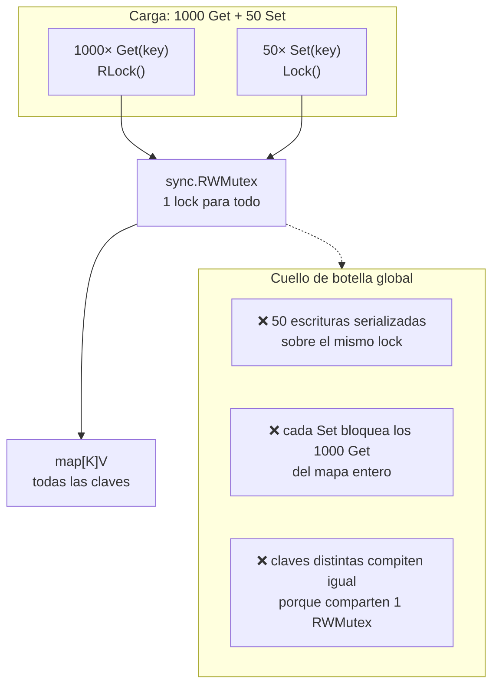
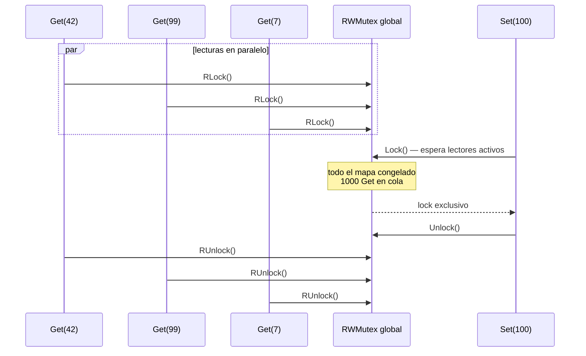
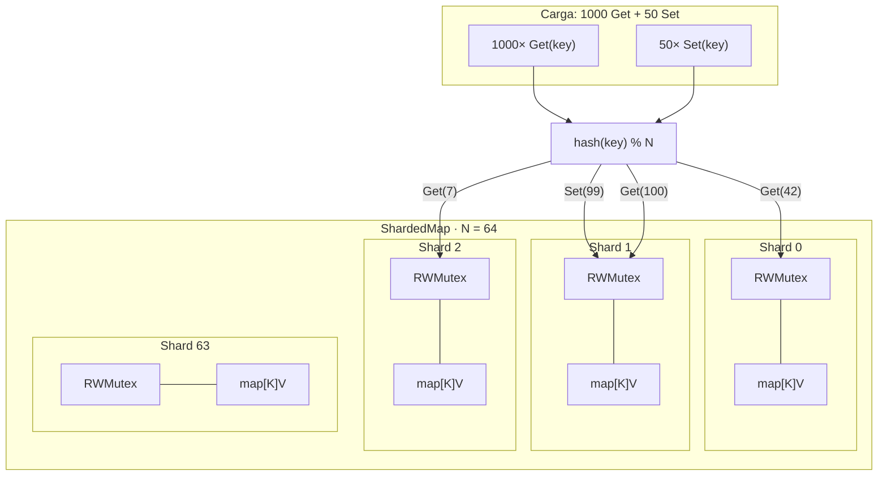
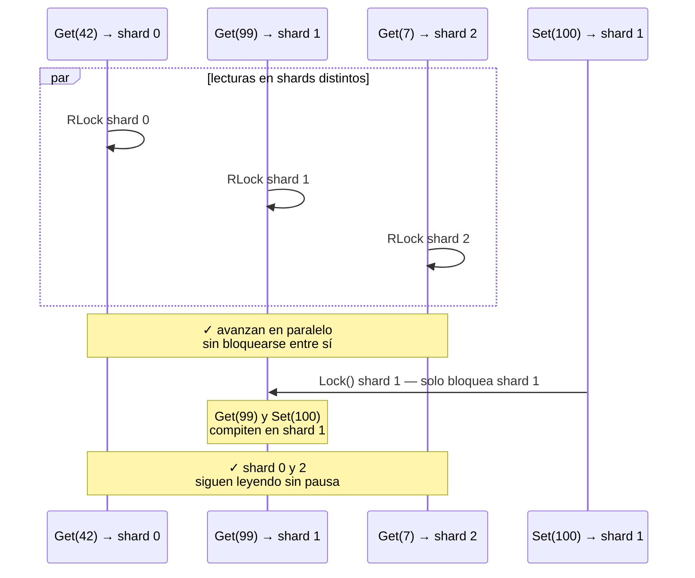

# Sharded Lock

Mapa concurrente (`ShardedMap`) que reparte un mapa en **N shards**, cada uno con su propio `sync.RWMutex` y su propio `map[K]V`.

Ejemplo de carga: **1000 lecturas + 50 escrituras** concurrentes.

---

## Enfoque 1: un solo `RWMutex` para todo el mapa

Un `map[K]V` protegido por **un único** `sync.RWMutex`. Las lecturas comparten lock; las escrituras lo toman en exclusiva.

| Operación | Lock | Efecto |
|-----------|------|--------|
| `Get` | `RLock()` | Paralelo entre lectores, **pero compite con writers** |
| `Set` / `Delete` | `Lock()` | Exclusivo — **pausa todas las lecturas y escrituras del mapa** |

Con 1000 lecturas y 50 escrituras, el `RWMutex` global sigue siendo un cuello de botella: cada escritura detiene temporalmente **todo** el mapa.

---

## Enfoque 2: Sharded Lock (`ShardedMap`)

El mapa se divide en **N buckets**. Cada bucket tiene su propio `RWMutex` y su propio `map[K]V`. La clave se enruta con `hash(key) % N`.

| Operación | Lock | Alcance |
|-----------|------|---------|
| `Get(key)` | `RLock()` | Solo `shards[hash(key) % N]` |
| `Set(key, v)` | `Lock()` | Solo `shards[hash(key) % N]` |
| `Delete(key)` | `Lock()` | Solo `shards[hash(key) % N]` |

Con la misma carga (1000 reads + 50 writes), las 50 escrituras se reparten entre shards (~1 por shard con N=64). Una escritura **solo pausa el bucket afectado**, no el mapa completo.
