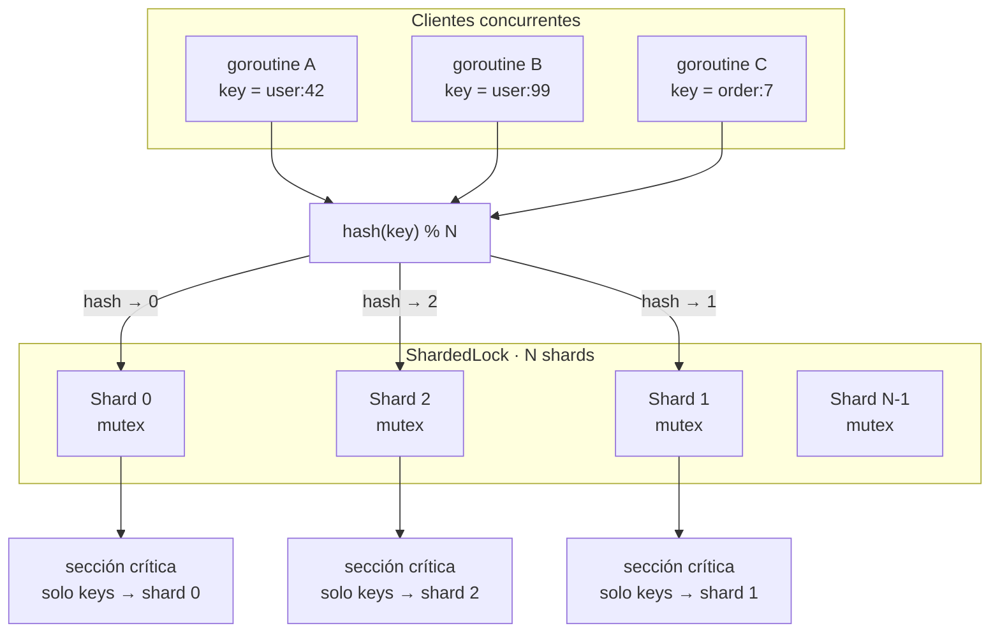

# Sharded Lock

Un **sharded lock** reparte la contención de un mutex global entre varios locks independientes (_shards_). Cada clave se mapea a un shard con un hash, de modo que operaciones sobre claves distintas pueden avanzar en paralelo.

## Flujo

1. La goroutine recibe una `key`.
2. Calcula `shard = hash(key) % N`.
3. Adquiere el mutex de ese shard (no el de todos).
4. Ejecuta la sección crítica y libera el lock.

Claves distintas con distinto shard no se bloquean entre sí; solo compiten las que caen en el mismo shard.
